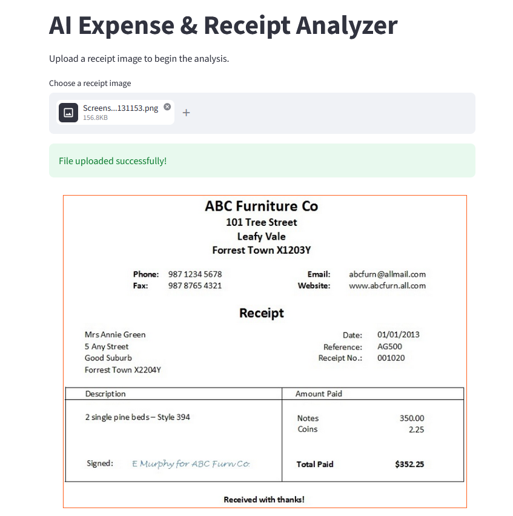
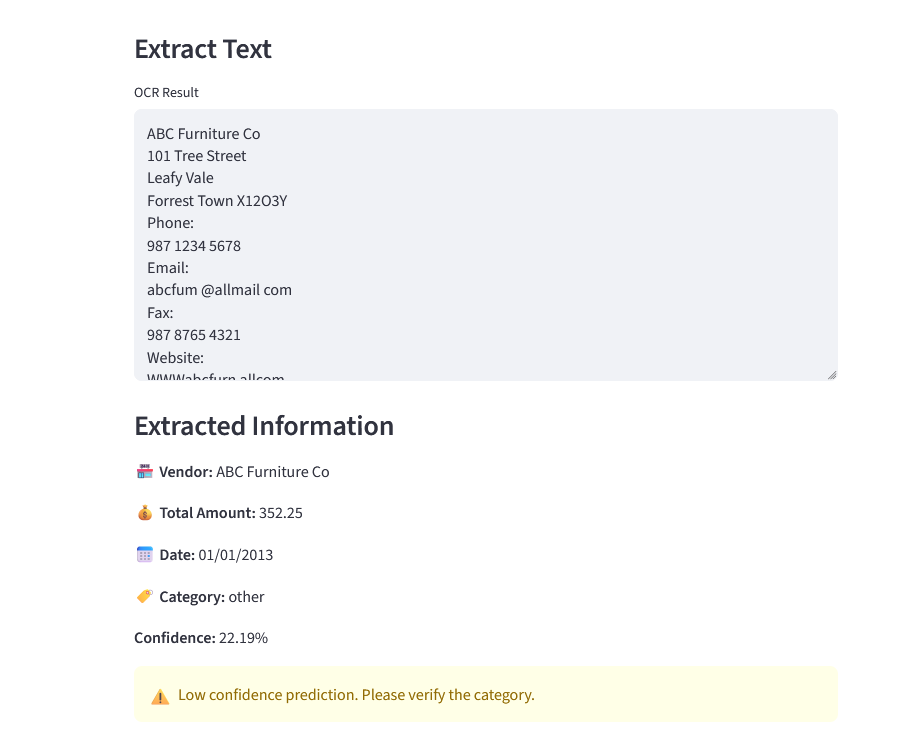
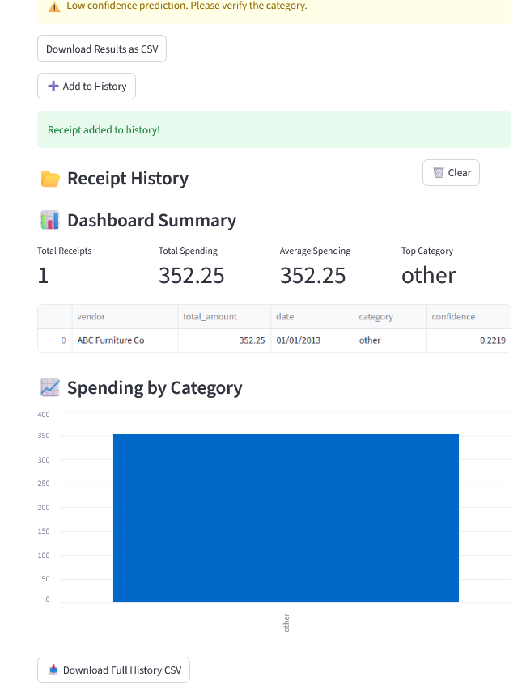

# 🧾 AI Expense & Receipt Analyzer

An end-to-end AI-powered application that extracts, analyzes, and categorizes expenses from receipt images using OCR and Machine Learning.

---

## 📌 Overview

Managing expenses manually from receipts is time-consuming and error-prone.

This project automates the process by:
- Extracting text from receipt images using OCR
- Identifying key information (vendor, total amount, date)
- Classifying expenses into categories using a trained ML model
- Providing a dashboard with insights and history tracking

---

## 🚀 Features

- 📷 Upload receipt images (PNG, JPG, JPEG)
- 🔍 OCR text extraction (EasyOCR)
- 🏪 Vendor detection
- 💰 Total amount extraction
- 📅 Date extraction
- 🧠 Machine Learning-based expense categorization
- 📊 Confidence score for predictions
- ⚠️ Low-confidence warnings
- 📂 Receipt history tracking (session-based)
- 🚫 Duplicate detection (prevents re-adding same receipt)
- 📊 Dashboard summary:
  - Total receipts
  - Total spending
  - Average spending
  - Top category
- 📈 Spending visualization by category
- 📥 Export results to CSV
- 📥 Export full history to CSV

---

## 🧠 How It Works (Pipeline)

```
Receipt Image
↓
OCR (EasyOCR)
↓
Raw Text
↓
Data Extraction
(vendor, total, date)
↓
Text Processing
↓
ML Classification (TF-IDF + Logistic Regression)
↓
Dashboard + History + CSV Export
```

---

## 🛠️ Tech Stack

- **Python**
- **Streamlit** – Web UI
- **EasyOCR** – Text extraction from images
- **scikit-learn** – Machine learning model
- **pandas** – Data processing
- **joblib** – Model persistence

---

## 📁 Project Structure

```
ai_expense_receipt_analyzer/
│
├── app.py # Streamlit application
├── requirements.txt
│
├── data/
│   ├── expense_categories.csv
│   └── expense_classifier.pkl
│
├── src/
│ ├── ocr.py # OCR logic
│ ├── extractor.py # Field extraction (vendor, total, date)
│ ├── classifier.py # Category prediction
│ └── train_classifier.py # Model training script
```

---

## ▶️ How to Run

### 1. Clone the repository
```bash
git clone https://github.com/your-username/ai_expense_receipt_analyzer.git
cd ai_expense_receipt_analyzer
```

### 2. Create virtual environment
```
python -m venv venv
source venv/bin/activate   # Mac/Linux
venv\Scripts\activate      # Windows
```

### 3. Install dependencies

```
pip install -r requirements.txt
```

### 4. Run the app

```
streamlit run app.py
```

##  🧪 Train the Model

```
python src/train_classifier.py
```

**This will:**

- Train the classifier
- Evaluate performance
- Save the model to:

```
data/expense_classifier.pkl
```

## 📊 Example Output

- Vendor: Starbucks
- Total: 4.50
- Date: 17/02/2022
- Category: food
- Confidence: 30%

## 📸 Screenshots

### Upload & OCR



### Extraction & Classification



### Dashboard & Analytics



## ⚠️ Limitations

- OCR accuracy depends on image quality
- Some receipts may not contain clear date or total fields
- Category classification depends on training dataset quality
- Duplicate detection is heuristic-based (vendor + total + date)


## 🔮 Future Improvements
- Improve OCR preprocessing (image enhancement)
- Use deep learning models (BERT, transformers)
- Add multi-language support
- Improve date and total extraction with regex tuning
- Store history in database instead of session
- Add user authentication
- Deploy as web app (Streamlit Cloud / AWS)

## Author 

Dimitris Loukakis   

📜 License

MIT License